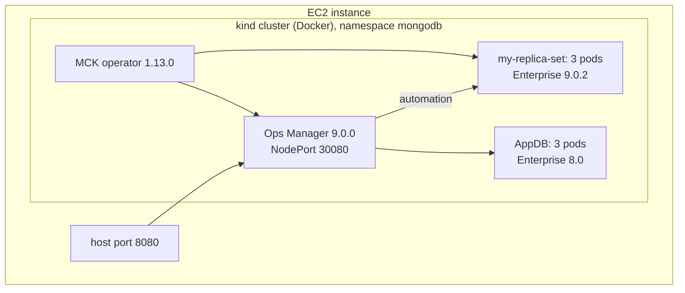

# MCK + Ops Manager + MongoDB Enterprise lab (kind on one EC2 host)

One script builds, on a single EC2 instance:

1. Docker, `kind`, `kubectl` and `helm`
2. A kind Kubernetes cluster
3. The **MongoDB Controllers for Kubernetes (MCK) 1.13.0** operator
4. **Ops Manager 9.0.0** with a 3-member **MongoDB Enterprise 8.0** application database
5. An Ops Manager project and API credentials, created through the API (no UI steps)
6. A 3-member **MongoDB Enterprise 9.0.2** replica set managed by that Ops Manager

It follows the "Installing Kind cluster" and "Ops Manager Installation" steps of the Operator hands-on
practice lab, updated to current versions and fully automated. Verified end to end on an Amazon Linux 2023
x86_64 host with 16 GiB of RAM.



## Versions

Set in [config.env](config.env); every value can be overridden from the environment.

| Component | Version | Notes |
| --- | --- | --- |
| kind / node image | v0.33.0 / `kindest/node:v1.34.11` | kind's default is Kubernetes 1.37, which MCK 1.13.0 does not document yet |
| kubectl | v1.34.11 | matches the node image |
| MCK operator | 1.13.0 | latest release; adds Ops Manager 9 support |
| Ops Manager | 9.0.0 | latest; agent 109.0.0 |
| AppDB | 8.0.32-ent | backing databases must be a major-release series |
| MongoDB deployment | 9.0.2-ent | latest Enterprise; present in Ops Manager 9's version manifest |

## Prerequisites

- One EC2 instance: **Amazon Linux 2023, x86_64** (the Ops Manager image is `linux/amd64` only).
- At least **16 GiB RAM** (`m5.xlarge`); `m5.2xlarge` (32 GiB) leaves headroom. 50 GiB gp3 root volume.
- Security group: 22 (SSH), and 8080 only if you want to open Ops Manager directly; otherwise use an SSH tunnel.
- Outbound internet access (Docker Hub, quay.io, downloads.mongodb.com, GitHub).

## Run

```bash
git clone https://github.com/vijaygh-repo/mck-om-enterprise-lab.git
cd mck-om-enterprise-lab
./mck-om-lab.sh
```

The script re-runs itself with `sudo` when needed. The first run takes 15-25 minutes, mostly image pulls and
Ops Manager's first start. It is safe to re-run: finished steps are skipped. It prints the Ops Manager URL and
login at the end and saves them to `/root/mck-om-credentials.txt`. All output is also written to
`/var/log/mck-om-lab.log`.

Before installing anything, the script checks that the host is x86_64 with about 16 GiB of RAM and 20 GiB of
free disk, and that Docker Hub, quay.io, downloads.mongodb.com and the other download sites are reachable. It
also checks that host port 8080 is free. An unsuitable host therefore fails in seconds with a clear message.

| Command | What it does |
| --- | --- |
| `./mck-om-lab.sh` | build the lab (or resume it; safe to run again) |
| `./mck-om-lab.sh stop` | shut the lab down cleanly before you stop the EC2 instance |
| `./mck-om-lab.sh start` | bring the existing lab back after the instance was stopped or rebooted |
| `./mck-om-lab.sh status` | pods, resource phases and the current login URL |
| `./cleanup.sh` | remove the whole lab (`./mck-om-lab.sh down` is the same command) |

Override any value from `config.env` in the environment, for example
`MDB_VERSION=8.0.32-ent ./mck-om-lab.sh` to deploy MongoDB 8.0 instead of 9.0.

## Logging in

1. Open `http://<ec2-public-ip>:8080`, or tunnel with `ssh -L 8080:localhost:8080 <user>@<ec2-public-ip>` and open
   `http://localhost:8080`.
2. Log in with the username and password the script printed (also in `/root/mck-om-credentials.txt`).
3. In the project `mck-lab-project`, **Deployment** shows `my-replica-set` with 3 members.

## How the no-UI setup works

- The operator creates the first Ops Manager user from the `ops-manager-admin-secret` secret and stores a
  global API key in the secret `mongodb-ops-manager-admin-key`.
- The script uses that key to create the project through the Ops Manager API, then writes the
  `my-credentials` secret and the `my-project` ConfigMap that the `MongoDB` resource refers to.

## Design notes

These are the problems found while building the lab, and how the script handles them:

- **Ops Manager first, then the AppDB.** The operator reports the AppDB `Running` only after Ops Manager is up,
  so the script waits for Ops Manager first.
- **Mail settings.** `mms.ignoreInitialUiSetup` makes Ops Manager validate its properties at start; without
  `mms.mail.hostname` (and transport and port) the pre-flight check fails and the pod crash-loops.
- **Stale crash-looping pod.** A StatefulSet never replaces a pod that is not Ready, so after a manifest fix the
  script deletes an Ops Manager pod that is crash-looping on an outdated revision.
- **Memory.** The operator limits the Ops Manager pod to 5 GB; the JVM heap and every `mongod` cache are capped
  so everything fits on a 16 GiB host.
- **Pinned Kubernetes 1.34.** kind's default is Kubernetes 1.37, newer than anything MCK 1.13.0 documents.
- **`sudo` and `PATH`.** `/usr/local/bin` is added to `PATH` because `sudo` drops it.
- **Instance stop/start.** The kind node is a Docker container that is stopped with the instance. `start` starts it
  again, regenerates the kubeconfig (Docker can publish the API server on a different host port), and treats a pod
  as Ready only if its container started after the node did, so statuses left over from before the shutdown are
  ignored. The kernel `inotify` limits kind needs are persisted in `/etc/sysctl.d/99-mck-lab.conf`.

## Stopping and starting the EC2 instance

The lab survives an instance stop and start. The kind node is a Docker container whose data lives on the
instance's EBS volume, so nothing has to be rebuilt.

**Before stopping the instance** (recommended; the MongoDB processes get a SIGTERM and time to shut down
cleanly, which takes 1-2 minutes):

```bash
cd ~/mck-om-enterprise-lab
./mck-om-lab.sh stop
```

Then stop the instance in the AWS console or CLI. Stopping it without this step also works, because MongoDB
recovers from its journal.

**After starting the instance:**

1. SSH in. The public IP changes on every start unless the instance has an Elastic IP.
2. Bring the lab back:

   ```bash
   cd ~/mck-om-enterprise-lab
   ./mck-om-lab.sh start
   ```

   This starts Docker and the kind node, waits for every pod to be `Ready` (usually 5-10 minutes), and prints
   the current Ops Manager URL and login. Update your browser bookmark or SSH tunnel with the new IP.
3. Check it at any time with `./mck-om-lab.sh status`.

Running plain `./mck-om-lab.sh` also resumes an existing lab. The manual equivalent of `start` is:

```bash
sudo systemctl start docker
sudo docker start mck-lab-control-plane
sudo kind export kubeconfig --name mck-lab
sudo kubectl -n mongodb get om,mdb,pods -w      # wait until everything is Running
```

Do not run `kind delete cluster` or `docker rm` on the node to "restart" the lab: that deletes all of its data.

## Removing the lab

```bash
./cleanup.sh            # asks you to type 'delete' first (./mck-om-lab.sh down does the same)
./cleanup.sh --yes      # no confirmation
./cleanup.sh --purge    # also remove kind, kubectl, helm, their caches and the kind node image
```

By default this deletes the kind cluster (Ops Manager, the AppDB, `my-replica-set` and **all their data**),
the saved credentials, the log file and the kernel-settings file. Docker and the base packages stay
installed; to remove Docker as well:

```bash
sudo systemctl disable --now docker && sudo dnf remove -y docker
```

Terminating the EC2 instance removes everything at once. The cloned repository itself is not touched; delete it
with `rm -rf ~/mck-om-enterprise-lab` when it is no longer needed.

## Useful commands

```bash
kubectl -n mongodb get om,mdb,pods
kubectl -n mongodb logs deployment/mongodb-kubernetes-operator --tail=50
kubectl -n mongodb describe om ops-manager
```

## Troubleshooting

- **The AppDB stays `Pending` while its pods are `Running`.** Normal: the operator marks the AppDB `Running` only
  after Ops Manager is up. Watch `STATE (OPSMANAGER)` instead.
- **`ops-manager-0` is in `CrashLoopBackOff`.** Ops Manager's pre-flight check names the reason:
  `kubectl -n mongodb logs ops-manager-0 --previous | grep -B10 'Pre-flight checks failed'`.
  After fixing a manifest, re-run the script; it recreates a crash-looping pod that still has an outdated spec
  (a StatefulSet never replaces a pod that is not Ready).
- **Watch progress:** `kubectl -n mongodb get om,mdb,pods -w`.
- **The lab is not back after the instance was started.** Run `./mck-om-lab.sh start` again; it is safe to repeat.
  `docker ps -a` shows whether the node container `mck-lab-control-plane` exists and is running, and
  `./mck-om-lab.sh status` shows the pods. If the pods are not Ready after 20 minutes, `start` prints diagnostics.
  The URL changes with the public IP; `start` and `status` print the current one.
- **A run stopped part-way.** Run `./mck-om-lab.sh` again; it resumes. When a wait fails it prints diagnostics
  (pods, events, the Ops Manager pre-flight reason, operator logs), and everything is in
  `/var/log/mck-om-lab.log`.

## Notes and limitations

- The lab runs one kind node, so all pods share one host; the replica set members are not spread across machines.
- Authentication and TLS are off on the managed replica set (lab only).
- Backup is not configured. Add `spec.backup` to the `MongoDBOpsManager` resource for that.
- Memory is capped for a 16 GiB host: Ops Manager heap `3g`, WiredTiger cache `0.25` GB per `mongod`. Raise
  `OM_HEAP` and `MONGOD_CACHE_GB` in `config.env` on a bigger instance.
