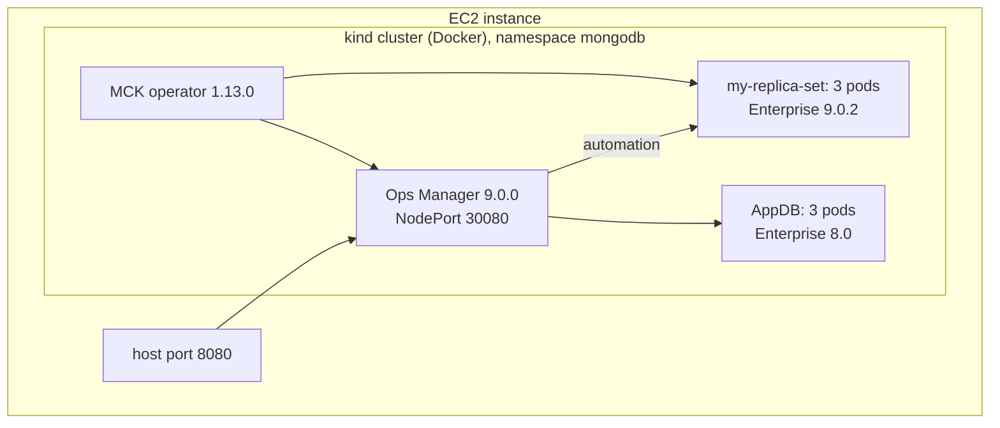

# MCK + Ops Manager + MongoDB Enterprise lab (kind on one EC2 host)

One script builds, on a single EC2 instance:

1. Docker, `kind`, `kubectl` and `helm`
2. A kind Kubernetes cluster
3. The **MongoDB Controllers for Kubernetes (MCK) 1.13.0** operator
4. **Ops Manager 9.0.0** with a 3-member **MongoDB Enterprise 8.0** application database
5. An Ops Manager project and API credentials, created through the API (no UI steps)
6. A 3-member **MongoDB Enterprise 9.0.2** replica set managed by that Ops Manager

It follows the "Installing Kind cluster" and "Ops Manager Installation" steps of the Operator hands-on
practice lab, updated to current versions and fully automated.



## Versions

Set in [config.env](config.env); every value can be overridden from the environment.

| Component | Version | Notes |
| --- | --- | --- |
| kind / node image | v0.33.0 / `kindest/node:v1.34.11` | kind's default is Kubernetes 1.37, which MCK 1.13.0 does not document yet |
| kubectl | v1.34.11 | matches the node image |
| MCK operator | 1.13.0 | latest release; adds Ops Manager 9 support |
| Ops Manager | 9.0.0 | latest; agent 109.0.0 |
| AppDB | 8.0.32-ent | backing databases must be a major-release series |
| MongoDB deployment | 9.0.2-ent | latest Enterprise; present in Ops Manager 9's version manifest |

## Prerequisites

- One EC2 instance: **Amazon Linux 2023, x86_64** (the Ops Manager image is `linux/amd64` only).
- At least **16 GiB RAM** (`m5.xlarge`); `m5.2xlarge` (32 GiB) leaves headroom. 50 GiB gp3 root volume.
- Security group: 22 (SSH), and 8080 only if you want to open Ops Manager directly; otherwise use an SSH tunnel.
- Outbound internet access (Docker Hub, quay.io, downloads.mongodb.com, GitHub).

## Run

```bash
git clone https://github.com/vijaygh-repo/mck-om-enterprise-lab.git
cd mck-om-enterprise-lab
sudo ./mck-om-lab.sh
```

The first run takes 15-25 minutes, mostly image pulls and Ops Manager's first start. The script is safe
to re-run: finished steps are skipped. It prints the Ops Manager URL and login at the end and saves them to
`/root/mck-om-credentials.txt`.

| Command | What it does |
| --- | --- |
| `sudo ./mck-om-lab.sh` | build the lab |
| `sudo ./mck-om-lab.sh status` | pods and resource phases |
| `sudo ./mck-om-lab.sh down` | delete the kind cluster |

## Logging in

1. Open `http://<ec2-public-ip>:8080`, or tunnel with `ssh -L 8080:localhost:8080 <user>@<ec2-public-ip>` and open
   `http://localhost:8080`.
2. Log in with the username and password the script printed (also in `/root/mck-om-credentials.txt`).
3. In the project `mck-lab-project`, **Deployment** shows `my-replica-set` with 3 members.

## How the no-UI setup works

- The operator creates the first Ops Manager user from the `ops-manager-admin-secret` secret and stores a
  global API key in the secret `mongodb-ops-manager-admin-key`.
- The script uses that key to create the project through the Ops Manager API, then writes the
  `my-credentials` secret and the `my-project` ConfigMap that the `MongoDB` resource refers to.

## Useful commands

```bash
kubectl -n mongodb get om,mdb,pods
kubectl -n mongodb logs deployment/mongodb-kubernetes-operator --tail=50
kubectl -n mongodb describe om ops-manager
```

## Troubleshooting

- **The AppDB stays `Pending` while its pods are `Running`.** Normal: the operator marks the AppDB `Running` only
  after Ops Manager is up. Watch `STATE (OPSMANAGER)` instead.
- **`ops-manager-0` is in `CrashLoopBackOff`.** Ops Manager's pre-flight check names the reason:
  `kubectl -n mongodb logs ops-manager-0 --previous | grep -B10 'Pre-flight checks failed'`.
  After fixing a manifest, re-run the script; it recreates a crash-looping pod that still has an outdated spec
  (a StatefulSet never replaces a pod that is not Ready).
- **Watch progress:** `kubectl -n mongodb get om,mdb,pods -w`.

## Notes and limitations

- The lab runs one kind node, so all pods share one host; the replica set members are not spread across machines.
- Authentication and TLS are off on the managed replica set (lab only).
- Backup is not configured. Add `spec.backup` to the `MongoDBOpsManager` resource for that.
- Memory is capped for a 16 GiB host: Ops Manager heap `3g`, WiredTiger cache `0.25` GB per `mongod`. Raise
  `OM_HEAP` and `MONGOD_CACHE_GB` in `config.env` on a bigger instance.
- MongoDB 9.0.2 and Ops Manager 9.0.0 are new. If the replica set does not deploy, retry with
  `MDB_VERSION=8.0.32-ent sudo -E ./mck-om-lab.sh`.
